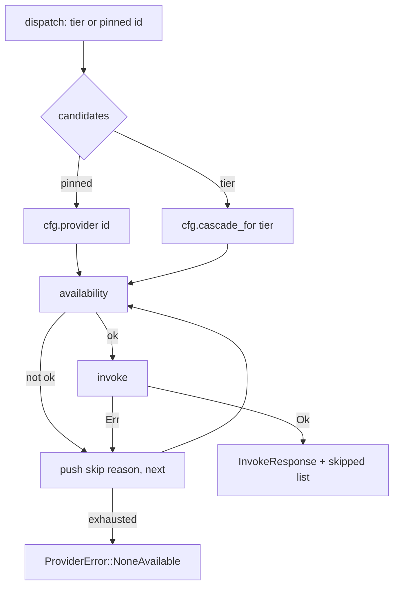

# Provider Integration

# Provider Integration (`loopsmith-provider`)

The provider plane turns "call a model" into "run a program." Every provider — Claude Code, Ollama, a Grok CLI, an OpenAI-compatible endpoint driven by `curl`, an MCP server over stdio — is described by the same struct: a command, some argument templates, and a few knobs. There is no per-vendor Rust code, no HTTP client, and no SDK. Adding a provider is a config edit.

That single decision is what makes BYOK free, and it is the reason this crate is small (one `lib.rs`) relative to its surface area.

## The two invariants

Everything else in the crate is mechanism. These two are the contract:

**1. A tier resolves through a cascade, not to a single provider.** Nodes ask for `Tier::Cheap`, `Tier::Standard`, or `Tier::Strong`. `dispatch` walks the ordered list configured for that tier and serves the call from the first provider that is both *available* (binary on `PATH`, required env present) and *succeeds*. Everything skipped is recorded and handed back to the caller so the ledger can say why.

**2. Secrets never enter this process.** `ProviderSpec::requires_env` names environment variables. `availability` checks them with `std::env::var_os(k).is_none()` — it reads presence, never value. Nothing is substituted into an argument, logged, or written to the ledger. The `openai` starter spec passes the literal string `Authorization: Bearer $OPENAI_API_KEY` to `curl` and lets `curl` expand it. There is a test (`a_provider_with_missing_env_is_unavailable_and_names_only_the_key`) that asserts the failure message contains the key *name* and no `=`, precisely because that is the property worth regression-testing.

## Types

| Type | Role |
|---|---|
| `InvokeRequest` | What to ask: `node_id`, `system`, `prompt`, `tier`, `workdir`. `node_id` is for logging and digests only. |
| `InvokeResponse` | What came back: `provider_id`, `output`, `exit_code`, `duration_ms`, `stderr_tail`, plus accounting (`tokens`, `tokens_estimated`, `cost_usd`). Serializable — it goes into the ledger. |
| `Availability` | `on_path: bool` + `missing_env: Vec<String>`. `ok()` is the gate, `why_not()` renders the human-readable reason that lands in the skip list. |
| `ProviderError` | `NoneAvailable` (cascade exhausted, with everything tried), `Spawn`, `Timeout`, `Failed` (non-zero exit + last stderr line). |

`ProviderSpec`, `ProviderKind`, `Tier`, and `LoopConfig` all live in `loopsmith-core` — this crate consumes the config model, it does not define it.

## How a call flows

`dispatch(cfg, req, pinned)` is the entry point almost every caller uses. Passing `Some(id)` for `pinned` collapses the candidate list to that one provider — but it does *not* skip the availability check, so pinning an unavailable provider yields `NoneAvailable` with a one-entry `tried` list rather than a spawn error.

## Inside `invoke`

`invoke` is the only place that touches a process. It does four things in order.

**Template rendering.** `render` substitutes `{prompt}`, `{system}`, `{model}`, `{tier}`, and `{node}` into each argument. It is a plain string replace over a `BTreeMap`, so unknown placeholders pass through untouched (`{unknown}` stays `{unknown}`) — a deliberate property, tested, so that a provider whose CLI uses brace syntax of its own isn't corrupted. Note that rendering applies to `spec.args` only, never to `spec.command`.

**Spawn.** `stdin` is `piped` when `prompt_on_stdin` is set and `null` otherwise; stdout and stderr are always piped. When piping, only `req.prompt` is written — `system` reaches the provider solely through a `{system}` placeholder in the args, so a spec that pipes the prompt and never mentions `{system}` silently drops the system message. That is worth checking when a new spec produces oddly context-free output.

**Timeout by polling.** `std::process` has no timeout, so the loop calls `try_wait` every 50 ms and compares `started.elapsed()` against `spec.timeout_seconds`. On expiry: `kill`, `wait`, `ProviderError::Timeout`. An async runtime would be tidier and is a heavy dependency for one feature, hence the poll. One consequence of the ordering: the stdin write happens before the poll loop begins, so a provider that never drains stdin can block on a very large prompt before the timer is ever consulted.

**Accounting.** Non-zero exit is always an error, never a silent pass. On success, `parse_usage` runs the spec's `usage_regex` against stdout, then stderr (providers report usage in wildly different places), preferring capture group 1 and falling back to the whole match, and stripping `,` and `_` before parsing. If nothing usable comes back — no regex, a malformed regex, or no match — `estimate_tokens` counts characters in prompt + stdout and divides by four, and `tokens_estimated` is set to `true`. Cost is `tokens / 1000.0 * cost_per_1k_tokens`, and is `None` when no rate is configured rather than a guessed number.

The estimate deserves its rationale, which the source states plainly: an approximate ceiling that fires beats an exact one that never does, which is what an unaccounted budget gate amounts to. The `tokens_estimated` flag exists so a budget report can be honest about which kind of number it is showing.

## Helpers worth knowing

- **`digest(s)`** — FNV-1a 64-bit, formatted as 16 hex chars. Not cryptographic. Its only job is to let the ledger say "same prompt as before" without storing the prompt twice. `run_node` in `src/run/dispatch.rs` calls it.
- **`which`** — re-exported from `loopsmith-util`. The path is kept here for existing callers; the implementation moved out once it turned out to have been written three times across the workspace, in three states of correctness.
- **`starter_providers()`** — the day-one cascade emitted by `loopsmith init` (via `starter_config` in `loopsmith-cli/src/scaffold.rs`): `claude` (standard + strong), `ollama` (cheap), `grok` (standard), `openai` (strong, the only one with a real `usage_regex` and cost rate), `gemini` (standard). Unavailable ones are skipped, never fatal — that is the whole point of the cascade. `starter_providers_cover_every_tier` guards the invariant that no tier is left with an empty list.

The `ollama` entry carries a 120-second timeout rather than the 600 its siblings use. `ollama run <model>` pulls the model when it is absent, and from outside the process a 4.7 GB pull is indistinguishable from slow generation — one observed run spent its entire 600-second budget downloading and produced nothing. A cheap tier exists to be abandoned quickly, so the timeout is tuned to fall through to the next provider rather than to accommodate a download. Pull first with `ollama pull llama3`.

## Where it connects

Upstream, this crate reads `LoopConfig` from `loopsmith-core` — specifically `cfg.provider(id)` and `cfg.cascade_for(tier)` in `src/config/mod.rs` — and `which`/`temp_dir` from `loopsmith-util`. It depends on nothing else in the workspace and knows nothing about the gate, the graph, or memory.

Downstream, three callers build an `InvokeRequest` and hand it to `dispatch`:

- `run_node` (`src/run/dispatch.rs`) — the main path. Also calls `digest` for prompt provenance.
- `ask_agent` (`src/run/perturb.rs`) — perturbation probes.
- `add_narrative` (`src/run/summary.rs`) — run summaries.

A fourth caller, `execute` in `src/cmd/providers.rs`, uses `availability` on its own to render the `loopsmith providers` doctor output without invoking anything.

The judge-independence rule — a judge must not run on the same provider as the builder whose work it is checking — is enforced by the caller choosing the `pinned` argument, not by this crate. `dispatch` has no notion of who is judging whom. Likewise, `goal_satisfied` is written by `loopsmith-gate` and by nothing else; no provider response reaching this crate can set it.

## Contributing

The test module at the bottom of `lib.rs` is the fastest way to understand the crate, and it is deliberately built out of POSIX utilities rather than mocks: `echo` for a working provider, `false` for one that fails, `cat` for stdin mode, `sleep 30` with a 1-second timeout for the kill path, and `definitely-not-a-real-binary-xyz` for the missing-binary path. Real processes, real exit codes.

Two conventions to preserve when adding tests:

- **Avoid double quotes in argument payloads.** `a_usage_regex_extracts_the_real_count` uses `total_tokens=1234` rather than JSON precisely because embedding quotes in an argument makes the test depend on platform escaping, which Windows does differently — it failed there for a reason unrelated to usage.
- **Assert the fallback, not just the happy path.** `a_malformed_usage_regex_falls_back_to_estimating` exists because `parse_usage` swallows a bad regex with `.ok()?`; the visible consequence is `tokens_estimated == true`, and that is what should be pinned down.

The crate's `Cargo.toml` ships `/src/**/*` and `README.md` only. Integration tests read `config/examples/` and `config/loop.schema.json` from the repository root, which no crate tarball can contain — shipping them would hand a published crate tests that cannot pass.

Adding a provider *kind* means adding a `ProviderKind` variant in `loopsmith-core`; adding a provider *instance* means editing config and nothing else. If you find yourself writing vendor-specific logic in `invoke`, the design has been violated somewhere upstream.