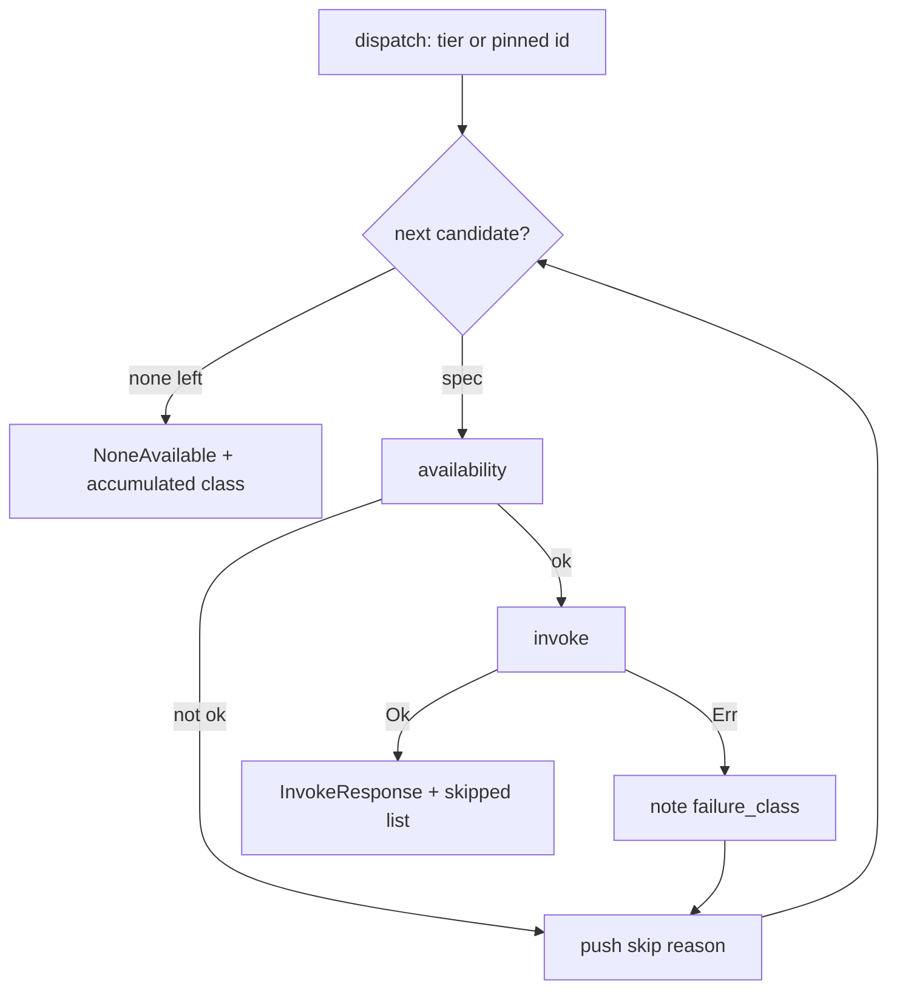

# Provider Integration

# Provider Integration (`loopsmith-provider`)

The provider plane turns "ask a model" into "run a program." Every provider in loopsmith — Claude Code, Ollama, a Grok CLI, an OpenAI-compatible HTTP endpoint driven by `curl`, an MCP server over stdio — is a command template: a binary name, an argument list with placeholders, and a few metadata fields. Adding a provider is a config edit, never a Rust change and never a rebuild.

This crate does four things: decide whether a provider is usable, expand its template and run it, account for what the call cost, and classify failures so the run engine knows whether retrying is worth wall-clock time.

## The command-template model

A provider is a `ProviderSpec` (defined in `loopsmith-core`, `src/config/providers.rs`). The fields this crate actually acts on:

| Field | Effect |
|---|---|
| `command` | the binary; looked up on `PATH` via `which` |
| `args` | argument list, each element run through `render` |
| `model` | substituted as `{model}` |
| `requires_env` | variable **names** that must exist; values are never read |
| `timeout_seconds` | polled kill deadline in `invoke` |
| `prompt_on_stdin` | pipe the prompt to stdin instead of passing `{prompt}` |
| `usage_regex` | pattern whose first capture group is a token count |
| `cost_per_1k_tokens` | rate applied to whatever token count was obtained |
| `tiers` | which tiers this provider may serve |

`render` substitutes `{prompt}`, `{system}`, `{model}`, `{tier}`, and `{node}` into a template string. Unknown placeholders are left verbatim — a provider whose real CLI takes `{foo}` as a literal keeps working, and a typo in a config placeholder shows up in the command line rather than silently becoming an empty string.

## Secrets never enter the process

This is the load-bearing constraint, and it is why `requires_env` holds names rather than values.

`availability` checks presence with `std::env::var_os(k).is_none()` and discards everything but the key name. `Availability::why_not` can therefore only ever say `missing env: OPENAI_API_KEY` — a test asserts the string contains no `=`, because there is no value present to leak. Nothing in this crate substitutes a secret into an argument, a log line, or the ledger.

The OpenAI starter provider shows the intended pattern: the `Authorization: Bearer $OPENAI_API_KEY` header is passed to `curl` *unexpanded*, and `curl` resolves it from its inherited environment. loopsmith never sees the key.

The same rule holds under containers. `container_argv` passes each required variable as `-e KEY` with no value, so the container runtime reads it out of this process's environment rather than putting it on a command line where any user on the machine could read it from the process table.

## Availability and the tier cascade

Nodes never name a provider; they ask for a `Tier` (`Cheap`, `Standard`, `Strong`). `dispatch` resolves that tier to an ordered candidate list via `cfg.cascade_for(req.tier)` and walks it:


```mermaid
flowchart TD
    D[dispatch: tier or pinned id] --> C{next candidate?}
    C -->|none left| N[NoneAvailable + accumulated class]
    C -->|spec| A[availability]
    A -->|not ok| S[push skip reason] --> C
    A -->|ok| I[invoke]
    I -->|Ok| R[InvokeResponse + skipped list]
    I -->|Err| F[note failure_class] --> S
```

Two details matter for contributors:

- **The skip list is a return value, not a log.** `dispatch` returns `(InvokeResponse, Vec<String>)`, where the vector holds `"id (reason)"` for every provider passed over. The ledger records *why* the winning provider won.
- **The failure class accumulates.** `class` starts at `ToolUnavailable` and latches to `TransientError` if any candidate failed transiently. So a cascade where the cheap tier was rate-limited and everything else was missing still reports a transient overall failure, which is the class that makes a retry worthwhile.

`pinned: Some(id)` bypasses the cascade entirely, collapsing the candidate list to `cfg.provider(id)`. That is the path a judge-independence or manual-override decision takes.

Under a container, `dispatch` rewrites the availability check: the provider binary lives in the image, so what must exist on this machine is `c.runtime`, not `spec.command`.

## Failure classification

`ProviderError::failure_class` maps into `loopsmith_core::FailureClass`, and the mapping encodes a policy about the run's wall-clock budget:

- `Timeout` → transient, by definition.
- `Spawn` → `ToolUnavailable`; the binary isn't there.
- `Failed` → transient **only** if `looks_transient(stderr)` matches one of its markers (`429`, `503`, `rate limit`, `overloaded`, `try again`, `connection reset`, `network`, …). Otherwise `ToolUnavailable`.

The asymmetry is deliberate. A wrong flag or a missing login fails identically on the second attempt, so retrying it with backoff only spends budget learning that. Only the stderr strings that describe a condition which may clear by itself earn a retry. `looks_transient` is a substring scan over a lowercased copy — cheap, and deliberately a little generous, since a false "transient" costs one retry while a false "unavailable" costs a node.

## Running a provider: `invoke`

`invoke` is the single place a child process is spawned. The sequence:

1. Build the substitution map (including `tier_name(req.tier)`) and render every argument.
2. Build the `Command` — either `spec.command` directly, or `container.runtime` with `container_argv(...)` when `req.container` is set.
3. `current_dir(&req.workdir)`; stdin piped only when `prompt_on_stdin`, stdout and stderr always piped.
4. Write the prompt to stdin if configured. A broken pipe here is swallowed on purpose: it means the child exited early, and the exit-code path below reports that far more usefully than an io error would.
5. **Poll for completion** at 50 ms intervals, killing the child once `timeout_seconds` elapses. `std::process` has no timeout, and an async runtime is a heavy dependency for one feature.
6. Non-zero exit → `ProviderError::Failed` with only the **last line** of stderr. A non-zero exit is never a silent pass.
7. On success, account for usage and cost, then build `InvokeResponse`.

### Usage and cost accounting

`invoke` tries `parse_usage(spec, &stdout)`, then `parse_usage(spec, &stderr)` — providers report usage in wildly inconsistent places. `parse_usage` compiles `usage_regex`, prefers capture group 1 and falls back to the whole match, and strips `,` and `_` before parsing. Every fallible step returns `None`, so a malformed regex degrades to estimation rather than failing the call.

When nothing usable is reported, `estimate_tokens` applies the four-characters-per-token approximation over prompt plus output and `InvokeResponse.tokens_estimated` is set to `true`. The response carries the distinction so a budget report can state which it is: an approximate ceiling that fires beats an exact one that never does, which is what an unaccounted budget gate amounts to.

`cost_usd` is `Some` only when both a token count and `cost_per_1k_tokens` exist. No rate means no cost, not a guessed one.

## Container execution

`Container { image, network, runtime }` describes where a provider runs. `container_argv` assembles:

```
run --rm [-i] [--network none] -v <workdir>:/work -w /work [-e KEY]... <image> <command> <args...>
```

`-i` appears only for stdin-mode providers. `--network none` is the default; `network: true` simply omits the flag. The node's working directory is mounted at `/work` and becomes the container's cwd, so a provider writing relative paths lands its output where the node expects it.

The provider CLI must exist *inside the image* — the host's copy is not visible in there, which is the point of the isolation. `loopsmith-run`'s `container` and `resolve` (`loopsmith-run/src/container.rs`) build these values; `loopsmith-core`'s validation warns about combinations that don't make sense, such as a sealed container fronting a hosted model.

## Supporting pieces

- **`digest`** — FNV-1a 64-bit over a string, hex-formatted. Not cryptographic. Its only job is to let the ledger say "this is the same prompt as before" without storing the prompt twice. `run_node` calls it for prompt provenance.
- **`which`** — re-exported from `loopsmith-util`. The path is kept here because callers already used it; the implementation moved out once it turned out to have been written three times across the workspace, in three states of correctness.
- **`starter_providers`** — the cascade `loopsmith init` writes into a fresh config, via `starter_config` (`loopsmith-cli/src/scaffold.rs`). Every entry is just a command, so unavailable ones are skipped rather than fatal, and a test asserts the set covers all three tiers. Note the deliberately short 120 s Ollama timeout: `ollama run <model>` silently pulls a missing model, and a multi-gigabyte download is indistinguishable from slow generation from out here. A cheap tier exists to be abandoned quickly, so it falls through to the next candidate instead of accommodating a download.

## How callers use it

| Caller | Uses |
|---|---|
| `loopsmith-run/src/dispatch.rs` → `run_node` | builds `InvokeRequest`, calls `dispatch`, records `digest` |
| `loopsmith-run/src/perturb.rs` → `ask_agent` | `dispatch` for adversarial perturbation prompts |
| `loopsmith-run/src/summary.rs` → `add_narrative` | `dispatch` for run narration |
| `loopsmith-cli/src/cmd/providers.rs` → `execute` | `availability` for the `loopsmith providers` readiness table |
| `loopsmith-cli/src/scaffold.rs` → `starter_config` | `starter_providers` |
| `loopsmith-run/src/container.rs` | constructs `Container` |

This crate deliberately knows nothing about goals, gates, or iteration. It takes an `InvokeRequest`, returns an `InvokeResponse` or a classified `ProviderError`, and leaves every decision about what to do next to the run engine.

## Contributing notes

- **Adding a provider is usually not a code change.** `ProviderKind` exists for labelling and wizard catalog purposes; routing behaviour comes entirely from `command`, `args`, `requires_env`, and `tiers`. Reach for a config example before reaching for `lib.rs`.
- **Never read an environment variable's value.** If a change needs a secret's contents, the design is wrong — the child process expands it.
- **New placeholders** go in the `vars` map in `invoke`; `render` needs no change. Keep unknown placeholders passing through untouched.
- **New transient markers** go in `looks_transient::MARKERS`, lowercase. Prefer a marker that appears in real provider stderr over a guess.
- **Tests run real binaries** (`echo`, `cat`, `false`, `sleep`, `sh`) rather than mocking the process boundary, which is the part most likely to be wrong. Keep new tests in that style, and keep shell quoting out of test arguments — one usage test was rewritten to avoid double quotes precisely because Windows escapes them differently, and the test failed there for a reason unrelated to usage.
- The crate's `include` list ships only `src/` and the README. Integration tests read `config/examples/` and `config/loop.schema.json` from the repository root, which no crate tarball can contain.