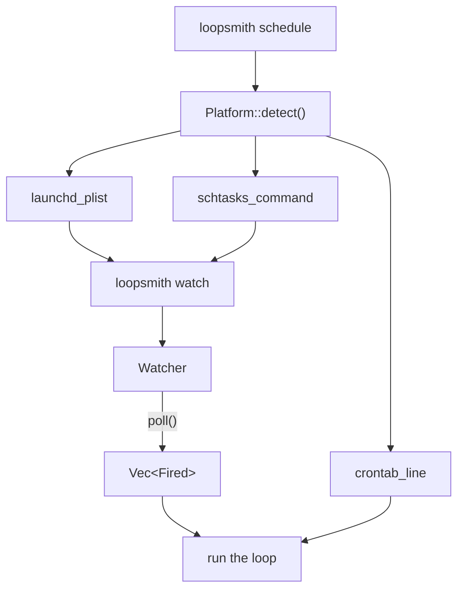

# Scheduling & Triggers

# Scheduling & Triggers

The scheduling module answers one question repeatedly: *should this loop run right now?* Without it, the `schedules` block of a loop config parses and validates and then nothing ever fires. Two files split the work:

| File | Responsibility |
|------|----------------|
| `runtime/crates/loopsmith-cli/src/schedule.rs` | Trigger evaluation (cron parsing, mtime scanning, edge detection) and generation of OS scheduler artifacts |
| `runtime/crates/loopsmith-cli/src/cmd/schedule.rs` | The `loopsmith schedule` command — picks the right scheduler for *this* machine and prints or installs the artifact |

The consumer of the evaluation half is `loopsmith watch` (`src/cmd/watch.rs`), which constructs a `Watcher`, sizes its sleep with `poll_interval`, and calls `poll` in a loop.

## The two halves



Note the asymmetry at the bottom: launchd and Task Scheduler are handed `watch` — one long-lived process that evaluates triggers itself — while a crontab line is handed `run`, a single iteration, because cron is itself the trigger evaluator in that arrangement. That distinction shows up again in `crontab()`, which falls back to `@reboot` when the config has no cron trigger for cron to act on.

## Time is UTC, deliberately

`CronExpr::matches` is evaluated against UTC, and the module says so in its own header. Deriving a local offset in a multithreaded Unix process is unsound without care, and a scheduler that is quietly an hour off twice a year is worse than one that is honestly in UTC. The `crontab` path prints a warning about this, because there the expression is interpreted by *cron*, in local time — a genuine discrepancy that the user needs to know about. For a cadence that shouldn't care about wall clocks at all, `Trigger::Interval` is the right answer.

Rather than pull in a date crate, the module carries `civil_from_unix`, a direct port of Howard Hinnant's `civil_from_days`, producing a `Civil { year, month, day, hour, minute, weekday }`. The weekday falls out of `(days + 4).rem_euclid(7)` because 1970-01-01 was a Thursday. This function has one out-of-module consumer: `logging::format_utc` uses it to stamp log lines.

## Cron parsing

`CronExpr::parse` takes the standard five fields — `minute hour day-of-month month day-of-week` — and delegates each to `parse_field(spec, min, max)`, which returns a `Field`:

```rust
pub enum Field {
    Any,                 // `*`
    Values(Vec<u32>),    // sorted, deduplicated
}
```

`parse_field` handles comma lists, `a-b` ranges, and `/step` suffixes in any combination (`*/15`, `9-17`, `1,15`). Because `Values` is kept sorted and deduplicated, `Field::matches` is a binary search.

Errors are strings that name the offending token: a step of `0` is rejected explicitly ("step of 0 would never fire") rather than looping forever, and out-of-range or inverted ranges report the bound they violated. Day-of-week accepts `0..=7` and `CronExpr::matches` treats `7` as Sunday when the computed weekday is `0`, matching every other cron.

`CronExpr::parse` returns `Result<Self, String>` and `Watcher::poll` swallows the error with `let Ok(c) = ... else { continue }` — a malformed expression that survived config validation makes its trigger inert rather than killing the watcher.

## The Watcher

`Watcher` holds the state that makes triggers *edges* rather than *levels*. All four maps exist to answer "have I already seen this?":

```rust
pub struct Watcher {
    fired_minute: BTreeMap<String, i64>,   // cron expr → minute-of-epoch
    last_interval_run: BTreeMap<u64, i64>, // period → last fire
    last_mtime: BTreeMap<String, u64>,     // watched path → last seen mtime
    satisfied_seen: BTreeMap<String, bool>,// goal → last known satisfaction
    ignore: Vec<String>,                   // extra dirs to skip
}
```

`poll(triggers, root, now, satisfied)` returns `Vec<Fired>` — every trigger that came due on this tick. Each variant has its own definition of "due":

- **`Trigger::Cron`** — the expression matches the current `Civil` *and* `fired_minute` does not already hold this minute-of-epoch. The watcher polls faster than once a minute, so without this guard a `* * * * *` entry would fire on every poll inside the minute.
- **`Trigger::Interval`** — the first `poll` primes `last_interval_run` and fires nothing; subsequent polls fire once `now - prev >= seconds`. Starting a watcher does not immediately kick off a run.
- **`Trigger::FileChange`** — compares `newest_mtime_ignoring(root.join(path))` against the last recorded value, firing only on a strict increase. A path with no previous entry records the current value and stays quiet.
- **`Trigger::GoalSatisfied`** — fires on the `false → true` transition only. Still-satisfied is not a new edge.
- **`Trigger::Manual`** — never fires from the watcher.

`Watcher::prime(triggers, root)` records the current mtime for every `FileChange` trigger without firing, so starting the watcher does not look like a change. `Watcher::ignoring(ignore)` is the constructor `watch.rs` actually uses, passing the success-export directory name.

### What the watcher must never see

`newest_mtime_ignoring` walks a path (depth-limited to 24) and returns the newest mtime in seconds, reporting `0` for a missing path — a watched path that does not exist yet is a normal state, not an error.

The skip list is where the real design pressure is:

```rust
const NEVER_WATCHED: [&str; 3] = ["state", ".git", "logs"];
```

Every one of these is written *by* a run. A watcher that noticed them would fire a run, which would write them, which would fire a run — a loop that is never idle again, with nothing in the output explaining why. `state/` is sled's directory; `logs/` holds the run log, written on every single iteration.

The `extra` parameter covers the case only the caller knows: the success export, whose directory is named after the loop and is written whenever a run meets its bar. That one is the same mistake with a longer fuse — the loop would cycle permanently *exactly when it succeeded*. Both cases are pinned by tests (`the_watcher_ignores_its_own_state_directory`, `the_watcher_ignores_the_run_log_and_the_success_export`), the second of which also asserts that an ordinary edit still registers, so the skip list can't quietly render the trigger inert.

### Poll cadence

`poll_interval(triggers)` returns the shortest sensible sleep for a trigger set, starting at 30s and tightening per trigger:

| Trigger | Ceiling | Why |
|---|---|---|
| `Cron` | 20s | Sub-minute polling, or a minute can be missed entirely |
| `FileChange` | 5s | Responsiveness to edits |
| `Interval { seconds }` | `seconds / 4`, floor 1 | Sample well inside the period |
| `Manual` | — | No constraint |

The result is clamped to at least 1s.

`Fired::describe()` renders the reason for the run log — `"cron `* * * * *` matched (UTC)"`, `"`src/` changed"`, and so on. It is the only place the *why* of a run becomes user-visible text.

## OS handoff

`schedule.rs` generates three artifacts as plain strings; none of them touch the filesystem:

- **`launchd_plist(label, exe, config, log_dir)`** — a `RunAtLoad` + `KeepAlive` agent invoking `loopsmith watch <config>`, with stdout and stderr pointed at the log dir.
- **`crontab_line(exe, config, expr, log_dir)`** — `<expr> <exe> run <config> >> <log_dir>/loopsmith.log 2>&1`.
- **`schtasks_command(label, exe, config)`** — a `schtasks /Create /F /RL LIMITED /TN "<label>" /SC MINUTE /MO 1 /TR ...` invocation. `/F` so re-running updates the task instead of clashing on the name; `/RL LIMITED` because a loop has no business running elevated.

The `schtasks` quoting is the fiddly part and has a test of its own. `/TR` takes the entire command as a single argument, so the paths inside it need a second level of escaping (`\"`) — `C:\Program Files\…` is the case that finds out whether it's there. The test also pins that the output is exactly one line, since pasting it into a shell is the whole delivery mechanism.

`default_label(loop_name)` produces `com.loopsmith.<sanitized>`, replacing every non-alphanumeric ASCII character with `-` so the label is safe for launchd.

`launch_agents_dir()` resolves `~/Library/LaunchAgents` via `loopsmith_util::platform::home_dir`, but `LOOPSMITH_LAUNCH_AGENTS_DIR` overrides it. That override exists for the test suite: installing a launch agent is a persistent, user-visible change, and a suite that makes one into a real home directory is a suite nobody can run twice.

## The `schedule` command

`cmd/schedule.rs::execute(config, install)` loads the config, resolves the absolute config path and current exe, creates `<root>/logs`, and dispatches on `Platform::detect().scheduler()`.

The dispatch key is **what is installed**, not what the OS is famous for. `cfg!(target_os = "macos")` tells you the build target had launchd; it does not tell you this machine has `launchctl` on `PATH`, and a container built `FROM debian` has neither `crontab` nor `systemctl` unless someone put them there. Printing a crontab line to a host with no cron is an instruction that silently does nothing.

When no scheduler is found, `execute` errors with the list of candidates that were actually probed — obtained from `preferred_names`, which re-reads `loopsmith_util::platform::preferred_schedulers(p.os)` rather than restating the list. The version that restated it told a Windows user to install `crontab`. The error also points at the fallback: `loopsmith watch` under any process supervisor — a systemd unit, a container restart policy, or a terminal left open.

The log directory is `<config_dir>/logs`, deliberately not `state/`. `state/` is sled's, and the watcher ignores everything inside it — including, until this was moved, the OS's own record of why the loop failed to start.

### What `--install` actually does

Only one of the three branches has somewhere safe to write:

| Scheduler | `--install` behavior |
|---|---|
| `launchctl` | Writes `<LaunchAgents>/<label>.plist`, then prints the `launchctl load -w` command for the user to run |
| `schtasks` | Prints the command; calls `nothing_to_install` — Task Scheduler's jobs live in a database reachable only through `schtasks` |
| crontab / other | Prints the line; calls `nothing_to_install` — a crontab is one file per user with no drop-in directory, so writing to it means rewriting entries this loop did not put there |

`nothing_to_install(reason)` exists so a flag that cannot do anything says so on stderr, instead of being silently accepted. A no-op flag is worse than one that explains itself: the user walks away believing something was installed.

Even in the launchd case, the module stops one step short. Writing the plist is reversible; `launchctl load -w` starts a process that survives reboots. That step stays the user's call, for the same reason `schtasks` prints rather than executes.

## Extending the module

- **Adding a trigger kind** means a new `Trigger` variant in `loopsmith-core`, a match arm in `Watcher::poll`, a matching `Fired` variant with a `describe()` string, whatever state it needs on `Watcher`, and a case in `poll_interval` if it constrains cadence. Ask whether the new trigger is an edge or a level — every existing one is an edge, and `poll` is called far more often than the thing it watches changes.
- **Anything a run writes** must be unreachable from `newest_mtime_ignoring`, either in `NEVER_WATCHED` or through the `extra` list. This is the module's recurring failure mode and the reason two of its tests read like incident reports.
- **Cron changes** should keep `parse` total over hostile input; the `malformed_expressions_are_rejected_with_a_reason` test enumerates the shapes that must stay rejected, `*/0` among them.
- **New scheduler backends** belong behind `Platform::scheduler()` and `preferred_schedulers` in `loopsmith-util`, so the probe and the error message keep sharing one list.