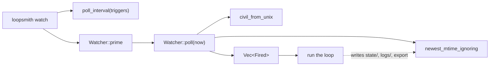

# Scheduling & Triggers

# Scheduling & Triggers

`runtime/crates/loopsmith-cli/src/schedule.rs` and `runtime/crates/loopsmith-cli/src/cmd/schedule.rs`

This module is what turns a `schedules:` block in a loop config from parsed data into something that actually fires. It has two halves that are deliberately independent:

1. **Trigger evaluation** (`schedule.rs`) — a cron parser, a UTC civil-time converter, and a `Watcher` that decides, on each poll, which triggers are due. This is the engine behind `loopsmith watch`, the long-lived process that keeps a loop alive for days or weeks.
2. **OS handoff** (`cmd/schedule.rs` + the generators at the bottom of `schedule.rs`) — `loopsmith schedule` emits a launchd plist, a crontab line, or a `schtasks` command so the loop survives a reboot without a terminal left open.

Everything in the first half is pure and testable: `Watcher::poll` takes the current time as a parameter rather than reading the clock, so the entire trigger matrix is exercised by unit tests with no sleeping.

## Time is UTC, on purpose

Cron expressions are evaluated in UTC, and this is a decision rather than an oversight (see the module doc comment). Deriving a local offset in a multithreaded process is unsound on Unix without care, and a scheduler that is silently an hour off twice a year is worse than one that is honestly in UTC. The `crontab` output path prints an explicit warning about this, because system cron *does* use local time — so the same expression means two different things depending on who evaluates it. For a cadence that shouldn't care about wall clock at all, `interval` is the right trigger.

`civil_from_unix(secs) -> Civil` does the conversion using Howard Hinnant's `civil_from_days` algorithm, deliberately hand-rolled so the scheduler adds no date-crate dependency the binary doesn't already carry. It yields `{year, month, day, hour, minute, weekday}`; weekday is derived from `(days + 4) % 7` because 1970-01-01 was a Thursday. It is also used outside this module — `logging::format_utc` calls it to timestamp log lines.

## Cron parsing

`CronExpr::parse` accepts the standard five fields — `minute hour day-of-month month day-of-week` — and rejects anything else with a message naming the field layout. Each field goes through `parse_field(spec, min, max)`, which handles `*`, comma lists, `a-b` ranges, and `/step` suffixes, in any combination (`*/15 9-17 1,15 * 1-5` parses). It normalizes to a sorted, deduplicated `Field::Values(Vec<u32>)`, so `Field::matches` is a binary search; `*` short-circuits to `Field::Any`.

Errors are strings that say what was wrong with which token: a step of `0` ("step of 0 would never fire"), a value out of range, a non-numeric bound. `day_of_week` is parsed with range `0..=7`, and `CronExpr::matches` treats a Sunday (`weekday == 0`) as matching a `7` in the expression, matching every other cron implementation.

There is no support for `@reboot`-style nicknames, names like `MON`, or `L`/`#` extensions. The one place `@reboot` appears is as a *fallback literal* in the crontab output path, and it is never fed back through the parser.

## The Watcher

`Watcher` holds the per-trigger state that has to survive between polls:

| Field | Purpose |
|---|---|
| `fired_minute` | expression → minute-of-epoch already handled, so a cron entry fires once per minute rather than once per poll |
| `last_interval_run` | seconds → timestamp of the last fire for that interval |
| `last_mtime` | watched path → newest mtime seen |
| `satisfied_seen` | goal → last known satisfaction, for edge detection |
| `ignore` | extra directory names that must not count as a change |

Construct it with `Watcher::ignoring(names)` when there are loop-specific directories to skip (in practice the success export, whose directory is named after the loop), or `Watcher::default()` otherwise.

`Watcher::prime(&triggers, root)` seeds `last_mtime` for every `FileChange` trigger without firing anything. Without it, starting the watcher would immediately look like a change on every watched path.

`Watcher::poll(&triggers, root, now, satisfied) -> Vec<Fired>` evaluates the whole trigger list once and returns every trigger that is due, each described by a `Fired` variant with a human-readable `describe()`:

- **`Trigger::Manual`** — never fires. That's the point of it.
- **`Trigger::Cron { expr }`** — parses the expression (an unparseable one is skipped, not fatal — validation happens at config load), matches it against `civil_from_unix(now)`, and guards on `fired_minute` so repeated polls inside the same minute produce one fire.
- **`Trigger::Interval { seconds }`** — the *first* poll records `now` and does not fire; subsequent polls fire once `now - prev >= seconds`. An interval therefore waits a full period before its first repeat.
- **`Trigger::FileChange { path }`** — compares `newest_mtime_ignoring(root.join(path), ignore)` against the stored value and fires when it strictly increases. State is updated on every poll, so one change produces exactly one fire.
- **`Trigger::GoalSatisfied { goal }`** — fires on the rising edge only. A goal that stays satisfied is not a new event.

`poll_interval(&triggers) -> Duration` picks how often the caller should poll, taking the tightest requirement across the set: 30s baseline, 20s if any cron trigger exists (sub-minute polling, or a minute can be missed entirely), 5s for file changes, and `seconds / 4` (floored at 1) for intervals. The result is never below one second.

The dotted edge is the feedback path the ignore list exists to break.

### Why the ignore list is load-bearing

`newest_mtime_ignoring(path, extra)` walks a path (depth-capped at 24) and returns the newest mtime found, in seconds. A missing path returns `0` rather than erroring — a watched path that doesn't exist yet is a normal state, not a failure.

The `NEVER_WATCHED` constant — `["state", ".git", "logs"]` — names directories a `file_change` trigger must never see at any depth, and `extra` adds the ones only the caller knows. Every entry is written *by* a run: `state/` is the sled ledger, `logs/` is the run log written on every single iteration, and the success export is written whenever a run meets its bar. A watcher that noticed any of them would fire a run, which would write them, which would fire a run — a loop that is never idle again, with nothing in the output explaining why. The success-export case is the nastiest, because the cycle starts precisely when the loop *succeeds*. Two tests pin this behaviour (`the_watcher_ignores_its_own_state_directory`, `the_watcher_ignores_the_run_log_and_the_success_export`), and the second also asserts that a genuine edit still registers — an over-eager skip list would make the trigger inert.

## `loopsmith schedule` — handing the job to the OS

`cmd::schedule::execute(config, install)` loads the config, resolves the current executable and an absolute config path, creates a `logs/` directory next to the config, and derives a job label via `default_label(&cfg.name)` (non-alphanumerics become `-`, prefixed `com.loopsmith.`, so it is safe for launchd).

Dispatch is on **what is installed, not what the OS is famous for**. `Platform::detect().scheduler()` probes for a real binary on `PATH`; a `cfg!(target_os = "macos")` would only tell you the build target had launchd, and a container built `FROM debian` may have neither `crontab` nor `systemctl`. Printing a crontab line to a host with no cron is an instruction that silently does nothing.

| `scheduler()` | Handler | Output |
|---|---|---|
| `Some("launchctl")` | `launchd` | `launchd_plist` — a `KeepAlive` agent running `loopsmith watch <config>` |
| `Some("schtasks")` | `schtasks` | `schtasks_command` — a `/SC MINUTE /MO 1` task running `loopsmith watch` |
| `Some(_)` | `crontab` | `crontab_line` — a cron line running `loopsmith run` once |
| `None` | — | An error naming the tools that were actually probed |

The `None` branch builds its message from `preferred_names(&platform)`, which re-reads the same `loopsmith_util::platform::preferred_schedulers` list the probe used. The earlier version restated the list by hand and told a Windows user to install `crontab`.

Note the asymmetry between launchd/schtasks (`watch`) and cron (`run`): the first two supervise a process, so the watcher owns trigger evaluation and the supervisor only has to keep one process alive. Cron has no supervision model, so it re-runs the loop once per firing, using the first `Trigger::Cron` expression found in the config or `@reboot` if there isn't one.

### What `--install` will and won't do

Only launchd has somewhere safe to write: a `LaunchAgents` directory where one plist is one job, so adding loopsmith's cannot disturb anyone else's. `launchd` writes `{label}.plist` into `launch_agents_dir()` and then *prints* the `launchctl load -w` command rather than running it — enabling an agent is a persistent, user-visible change to the machine and stays the user's call.

For the other two, `nothing_to_install(reason)` prints an explicit note on stderr explaining why nothing was written: a crontab is one file per user with no drop-in directory (writing to it means rewriting entries this loop didn't create), and Task Scheduler keeps jobs in a database reachable only through `schtasks` itself. A flag that silently no-ops is worse than one that explains itself.

`launch_agents_dir()` honours `LOOPSMITH_LAUNCH_AGENTS_DIR` before falling back to `~/Library/LaunchAgents`. That override exists so the test suite can exercise `--install` without writing a launch agent into the home directory of whatever machine it runs on — a suite that installs a real launch agent is one nobody can run twice.

### The `schtasks` quoting

`schtasks_command` is the fiddliest generator, because `/TR` takes the entire command as one argument. The outer value is quoted for `schtasks`, and both paths inside it are quoted *again* with `\"` — `C:\Program Files\loopsmith\loopsmith.exe` is the common case that finds out whether that second level is there. The flags are chosen deliberately: `/F` so re-running updates the task instead of failing on a name clash, `/RL LIMITED` because a loop has no business running elevated, and `/SC MINUTE /MO 1` with `watch` so Task Scheduler only has to keep one process alive. `the_schtasks_command_quotes_a_path_containing_a_space` pins all of this, including that the result is a single line — pasting it into a shell is the entire delivery mechanism.

Logs go to `<config-dir>/logs/`, not `state/`. `state/` is sled's directory and the watcher ignores everything inside it — including, until this was moved, the operating system's own record of why the loop failed to start.

## Integration points

- **`loopsmith_core::Trigger`** is the input type for the whole evaluation half. Adding a variant there means adding arms in `Watcher::poll` and, if it changes polling urgency, in `poll_interval`.
- **`cmd/watch.rs`** is the only production consumer of the `Watcher`: it calls `Watcher::ignoring`, `poll_interval`, and `now_unix`, and drives the poll loop.
- **`loopsmith_util::platform`** supplies `detect`, `scheduler`, `preferred_schedulers`, and `home_dir`. Scheduler-detection changes belong there, not here.
- **`logging::format_utc`** depends on `civil_from_unix`, so changes to `Civil` reach beyond the scheduler.

## Contributing notes

- Add trigger tests to the module's `mod tests` and drive them with explicit timestamps rather than sleeping. Where mtime resolution matters, the existing tests use `File::set_modified` with a future `SystemTime` (see `a_file_change_fires_once_per_change`) instead of waiting a second.
- Any new file or directory a run writes into the loop root must be added to `NEVER_WATCHED`, or passed through `Watcher::ignoring`, before it ships. The failure mode is a loop that never goes idle and gives no clue why.
- Generators (`launchd_plist`, `crontab_line`, `schtasks_command`) return strings and touch no filesystem or process state. Keep it that way — every persistent change to the user's machine lives in `cmd/schedule.rs`, and the ones that can't be made safely are printed for the user to run themselves.