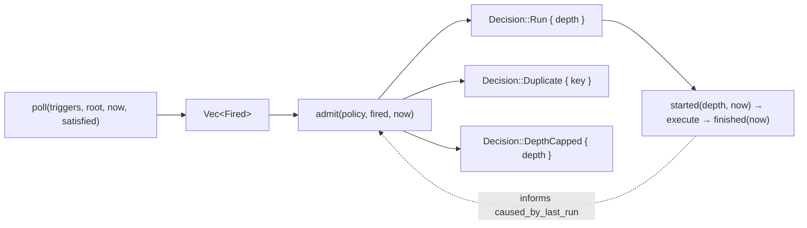
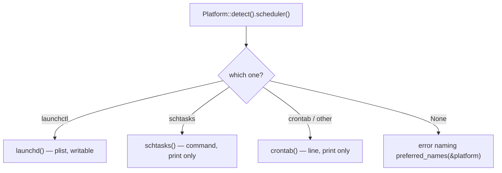

# Scheduling & Triggers

# Scheduling & Triggers

What starts a run, what stops a run from starting itself forever, and how the schedule survives a reboot.

Without this module `execution.triggers` is decoration: the config parses, validates, and then nothing ever fires it. Three layers do the work, and they live in three crates:

| Layer | Where | Responsibility |
|---|---|---|
| Config | `loopsmith-core/src/config/triggers.rs` | The trigger vocabulary and the policy around it (`Trigger`, `TriggerSpec`, `TriggerPolicy`) |
| Runtime | `loopsmith-run/src/schedule.rs` | Cron parsing, the `Watcher` that decides what is due, and the OS handoff text generators |
| Commands | `loopsmith-cli/src/cmd/watch.rs`, `cmd/schedule.rs` | `loopsmith run watch` (the resident process) and `loopsmith run schedule` (hand the job to the OS) |

`loopsmith-util/src/platform.rs` supplies the one fact the handoff cannot guess: which scheduler is actually installed.

## The trigger vocabulary

Five variants, tagged by `type` in YAML/markdown:

```yaml
triggers:
  - on: { type: cron, expr: "0 2 * * *" }
  - on: { type: interval, seconds: 900 }
  - on: { type: file_change, path: inbox }
    idempotency_key: inbox
  - on: { type: goal_satisfied, goal: docs-current }
  - on: { type: manual }
```

The trigger is nested under `on:` rather than flattened into `TriggerSpec`. Flattening would read better and would have let the 0.3 spelling parse untouched, but serde refuses `deny_unknown_fields` on a struct with a flattened field — and losing that guard means a misspelled `idempotency_kye` is silently dropped, leaving a trigger with no dedup and no warning. `config::legacy::repair_triggers` wraps old bare triggers in `on:` instead, so the cost is one migration function rather than a whole class of silent config bugs.

`TriggerSpec` adds two pieces of bookkeeping: `idempotency_key` (optional; derived when unset) and `enabled` (defaults true, so a trigger can be switched off for an afternoon without deleting it). Every code path that iterates triggers filters on `t.enabled` — `Watcher::prime`, `Watcher::poll`, `poll_interval`, `TriggerPolicy::has_self_reachable_trigger` and `key_for` all do.

### Self-reachable triggers and the two guards

`Trigger::is_self_reachable()` is true for exactly `FileChange` and `GoalSatisfied`. Those are the two a run's own output can fire: a run that writes into the directory it watches, or satisfies the goal it watches, fires itself. Cron and interval are driven by a clock no run can advance.

`TriggerPolicy` carries the guards against that shape:

- `max_depth` (default 5) — how long a chain of self-started runs may get. `may_chain(depth)` is `depth < max_depth`.
- `dedup_window_seconds` (default 300) — two firings with the same idempotency key inside this window are one firing.

## Cron, parsed here

`CronExpr::parse` takes the standard five fields (`minute hour day-of-month month day-of-week`) and supports `*`, lists, ranges and steps (`*/15 9-17 1,15 * 1-5`). `0` and `7` both mean Sunday, as in every other cron. A field parses into `Field::Any` or `Field::Values(Vec<u32>)` — sorted and deduplicated, so `matches` is a binary search. Malformed input is rejected with a reason (`step of 0 would never fire`, `` `60` is outside 0..=59 ``), not silently accepted.

**Cron is evaluated in UTC.** Deriving a correct local offset in a multithreaded process is unsound on Unix without care, and a scheduler quietly an hour off twice a year is worse than one honestly in UTC. `civil_from_unix` (Howard Hinnant's `civil_from_days`) breaks a Unix timestamp into a `Civil` struct with no date-crate dependency. For cadence that does not need a wall-clock time, prefer `interval`.

## The watcher

`Watcher` holds all trigger state between polls: last-fired minute per cron expression, last run time per interval, last mtime per watched path, last seen satisfaction per goal, the admitted-key ledger, and the depth and time window of the most recent run.


```mermaid
flowchart LR
    P["poll(triggers, root, now, satisfied)"] --> F["Vec&lt;Fired&gt;"]
    F --> A["admit(policy, fired, now)"]
    A --> R["Decision::Run { depth }"]
    A --> D["Decision::Duplicate { key }"]
    A --> C["Decision::DepthCapped { depth }"]
    R --> S["started(depth, now) → execute → finished(now)"]
    S -.->|"informs caused_by_last_run"| A
```

### poll — what is due

Each variant is edge-triggered, not level-triggered:

- **Cron** fires at most once per minute-of-epoch, not once per poll inside that minute.
- **Interval** primes on first sight and fires only after `seconds` have actually elapsed, so starting the watcher is not itself a firing.
- **FileChange** compares `newest_mtime_ignoring` against the stored value; `prime()` seeds it so start-up does not look like a change.
- **GoalSatisfied** fires on the `false → true` transition only.
- **Manual** never fires from `poll`.

`newest_mtime_ignoring` walks a path (depth-capped at 24) for the newest mtime anywhere under it, and a missing path reports `0` rather than erroring — a watched path that does not exist yet is a normal state. It skips `NEVER_WATCHED = ["state", ".git", "logs"]` at any depth, plus whatever extra directory names the caller passes. Every entry there is written *by* a run: a watcher that noticed them would fire a run, which would write them, which would fire a run, and nothing in the output would say why. `logs/` is in the list for exactly the same reason `state/` is — the run log is written on every iteration.

### admit — whether a firing becomes a run

`admit` returns a `Decision` and is the only place the two guards are enforced.

**Idempotency.** `key_for` prefers the trigger's explicit `idempotency_key`; otherwise it derives one from what fired — `cron:{expr}:{minute}`, `interval:{secs}:{slot}`, `file:{path}:{mtime}`, `goal:{goal}:{now}`. A derived key almost never repeats, which is right for cron and interval. The explicit key is for events noisier than their cause: six files landing in one directory at once are one event, not six.

**Depth.** A clock firing starts a chain at depth 0. A self-reachable firing extends the chain the last run started, and is refused with `DepthCapped` once that chain is `max_depth` long.

`caused_by_last_run` decides which of those applies, and the distinction matters: a `GoalSatisfied` firing after a run is attributed to it, but a `FileChange` is attributed only when the file's new mtime falls inside the run's window, widened by `ATTRIBUTION_GRACE_SECONDS` (5) because filesystems stamp mtimes coarsely and a run's last write can land just after the engine returns. A file a human drops into a watched directory an hour later is a fresh cause, starts a fresh chain at depth 0, and is never refused by a cap that exists to stop the loop feeding itself.

### poll_interval — how often to look

`poll_interval` returns the shortest cadence the enabled trigger set demands: 30s by default, 20s if any cron is present (a minute can otherwise be missed), 5s for `file_change`, and `seconds / 4` for an interval. Floored at 1s.

## `loopsmith run watch`

`cmd/watch.rs` is the resident process — what makes a loop live for weeks rather than for one invocation. It loads the config with `load_validated`, and refuses up front when the trigger list is empty or entirely `manual`, because `watch` would then sleep forever. `--check` prints the trigger set and the poll interval, then exits without running anything. `--max-runs N` stops after N runs.

Three behaviours in the loop are worth knowing before you change it:

1. **The success export is ignored.** The watcher is built as `Watcher::ignoring(vec![format!("{}-success", cfg.name)])`. That directory is written whenever a run meets its bar, so a `file_change` trigger on the loop root would otherwise see it and start another run — a permanent cycle that begins exactly when the loop succeeds.
2. **Goal state is read fresh each poll**, from the last run's `goal_states` in the store, so a run started elsewhere still feeds `goal_satisfied`.
3. **Several firings in one poll start one run**, at the shallowest depth any of them allows (`depth.map_or(d, |x| x.min(d))`); the reasons are joined into one `why` line. Non-admitted firings print why they were skipped or refused, naming the dedup window or `max_depth`.

A failed run prints `run failed: …` and the loop continues. That is the difference between a scheduler and a one-shot.

## `loopsmith run schedule` — the OS handoff

`watch` needs a process supervisor. `schedule` writes or prints the thing that supervises it.

Which scheduler to use is decided by what is **installed**, not by what the operating system is famous for. `cfg!(target_os = "macos")` says the build target had launchd; it does not say this machine has `launchctl` on `PATH`, and a container built `FROM debian` has neither `crontab` nor `systemctl` unless someone put them there. `Platform::detect()` filters `preferred_schedulers(os)` through `which`, and `Platform::scheduler()` returns the first survivor.


```mermaid
flowchart TD
    D["Platform::detect().scheduler()"] --> L{"which one?"}
    L -->|launchctl| A["launchd() — plist, writable"]
    L -->|schtasks| B["schtasks() — command, print only"]
    L -->|crontab / other| C["crontab() — line, print only"]
    L -->|None| E["error naming preferred_names(&platform)"]
```

The `None` arm is why `preferred_names` exists: it re-reads the same `preferred_schedulers` list the probe used instead of restating it. The version that restated it told a Windows user to install `crontab`.

### What each backend emits

- **launchd** — `launchd_plist(label, exe, config, log_dir)` builds an agent that runs `loopsmith run watch <config>` with `RunAtLoad` and `KeepAlive`, logging to `loopsmith.out.log` / `loopsmith.err.log`. `--install` writes it to `launch_agents_dir()/{label}.plist`; `LOOPSMITH_LAUNCH_AGENTS_DIR` overrides that directory so the test suite can exercise `--install` without installing a launch agent into whoever's home directory the suite runs in. Loading it (`launchctl load -w`) stays the user's call — it is a persistent, user-visible change to their machine.
- **crontab** — `crontab_line(exe, config, expr, log_dir)` produces `<expr> <exe> run start <config> >> …`, one run per firing rather than a resident watcher. The expression is the first `Trigger::Cron` in the config, falling back to `@reboot` (which keeps a watcher-shaped arrangement alive for configs whose triggers aren't cron). The printed note flags the mismatch that bites here: loopsmith evaluates cron in UTC, cron itself in local time.
- **schtasks** — `schtasks_command(label, exe, config)` returns a single-line `schtasks /Create /F /RL LIMITED /TN "<label>" /SC MINUTE /MO 1 /TR "…run watch…"`. `watch`, not `run`, because the watcher owns trigger evaluation and Task Scheduler then only has to keep one process alive. `/RL LIMITED` because a loop has no business elevated; `/F` so re-running updates the task instead of failing on a name clash. The double-quoting inside `/TR` is load-bearing — `C:\Program Files\…` is the common case, and a test pins it.

Labels come from `default_label(loop_name)`: `com.loopsmith.` plus the name with every non-alphanumeric character replaced by `-`, which is what makes it safe for launchd.

### `--install` is honest about doing nothing

Only launchd has somewhere safe to write: a LaunchAgents directory where one plist is one job. A crontab is one file per user with no drop-in directory, and Task Scheduler keeps its jobs in a database reached only through `schtasks`. Rather than accepting `--install` and ignoring it, both of those call `nothing_to_install(reason)`, which explains on stderr why there is nothing to write. A flag that is silently a no-op is worse than one that explains itself — the user is left believing something was installed.

Logs go to `<config dir>/logs`, created by `execute` before the handoff. Deliberately not `state/`: that directory is sled's, and the watcher ignores everything inside it — including, until this moved, the operating system's own record of why the loop failed to start.

## Configuration surface

Triggers live at `execution.triggers` (a `TriggerPolicy` inside `Execution`). In markdown configs the section is `Triggers`, keyed by `on.type` with `triggers` as the list field (`md::section_shape`, `md::SECTION_PATHS`). A 0.3 document's `schedules` section is relocated to `execution.triggers.triggers` by `config::legacy`, and each bare entry wrapped in `on:` by `repair_triggers` — which is why `cmd/schedule.rs` reaches the list as `cfg.execution.triggers.triggers` regardless of which spelling the file on disk used.

Both commands are reachable as `loopsmith run watch`/`loopsmith run schedule` and, via `cli::alias`, as the shorter `loopsmith watch`/`loopsmith schedule`.

## Contributing notes

- `cmd/schedule.rs` uses `loopsmith_core::load`, not `load_validated`: printing a plist for a config with a failing gate is still useful. `cmd/watch.rs` validates, because it is about to run the thing.
- Adding a trigger variant means touching `Trigger`, `Trigger::is_self_reachable`, `Fired` and its `is_from`/`describe`/`is_self_reachable`, `Watcher::poll`, `key_for`, and `poll_interval`. Decide deliberately whether a run's own output can cause it — that answer is what `max_depth` enforces.
- Anything a run writes on every iteration must be added to `NEVER_WATCHED` (or passed as an `ignore` name) before a `file_change` trigger can point at the loop root. The regression tests for `state/`, `logs/` and the success export in `loopsmith-run/src/schedule.rs` are the record of that going wrong.
- The generator functions are pure string builders with no side effects, which is what makes the handoff testable; keep the writing in `cmd/schedule.rs` and the text in `loopsmith-run`.