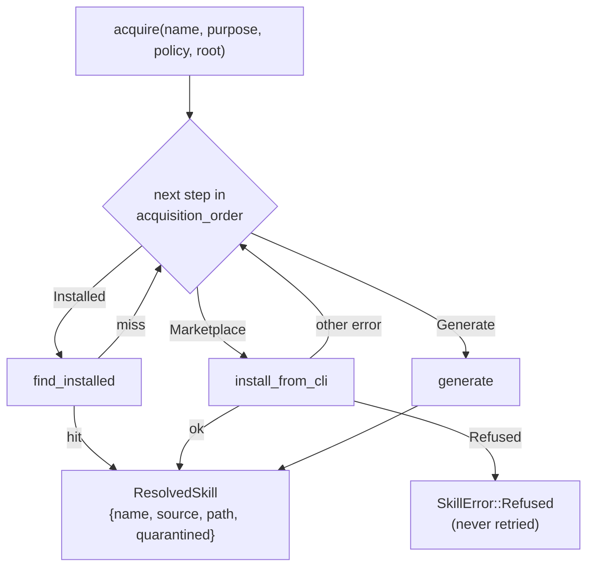
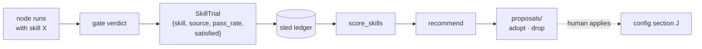

# Skills System

# Skills System (`loopsmith-skills`)

How a loop gets the sub-agents it needs, and how it learns which ones were worth having.

The crate has two responsibilities that look unrelated but are two halves of one idea:

1. **Acquisition** — resolve a required skill name to a directory on disk, trying installed skills, then the marketplace, then generation.
2. **Outcome ranking** — pair each skill use with the gate verdict that followed it, and turn that history into adopt/drop recommendations.

The second exists because the first cannot be decided by reasoning. A loop has no way to know in advance which sub-agents earn their keep; it has to try one, watch the gate, and keep what correlates with satisfied goals. Acquisition is an action the loop takes on its own. *Adoption* — writing a skill into the config — is a proposal a human applies.

## Design invariants

Three rules shape nearly every function here.

**Quarantine, not installation.** Anything fetched or generated lands under `policy.quarantine_dir` (`generated-skills/` by default), never in `~/.claude/skills/`. An acquired sub-agent runs with whatever the permission grant allowed, so acquisition is a proposal and promotion stays a human act. `ResolvedSkill::quarantined` carries the flag to every caller.

**Refuse, don't sanitise.** `is_safe_name` returns a bool; callers turn a `false` into `SkillError::Refused`. A silently rewritten skill name installs something the caller did not ask for. `is_safe_repo_url` (from `loopsmith-core`) applies the same logic to git URLs — https only.

**Popularity is not trust.** `is_blocklisted` matches credential-shaped substrings (`credential`, `secret`, `exfil`, `keylog`, `password`, `token-steal`) case-insensitively and is applied *after* star ranking, at both the install boundary and inside `rank_entries`. The test `a_high_star_credential_grabber_is_still_excluded` pins this: a 9,000-star entry that matches the query is still dropped.

Network access is shelled out to `curl`, `npx`, and `git` rather than linked in. That keeps the crate free of an HTTP client, and means a machine without those binaries degrades to "installed only" instead of failing to build. Every shelled call goes through the private `run()` helper, which checks `which(cmd)` first and returns `SkillError::Missing` rather than an opaque `NotFound` io error.

## Acquisition

`acquire(name, purpose, policy, project_root)` walks `policy.acquisition_order` — a `Vec<AcquisitionSource>` from section J of the config, defaulting to `["installed", "marketplace", "generate"]`.

The asymmetry in the marketplace arm is deliberate: a `Refused` (unsafe name, blocklist hit) aborts the whole walk, because falling through to `generate` after refusing to install would produce a skill under a name the safety check rejected. Any other failure — `npx` missing, network down, package not found — is a soft miss and the walk continues.

### Finding what's already there

`skill_search_paths` returns the search order, nearest first:

| Position | Directory | Quarantined? |
|---|---|---|
| 1 | `<root>/.claude/skills` | no |
| 2 | `<root>/generated-skills` | yes |
| 3 | `<home>/.claude/skills` | no |

Home comes from `loopsmith_util::platform::home_dir()`, not `$HOME` directly — Windows does not set `HOME` outside a POSIX emulation layer, and the user-level directory would silently vanish there.

A skill *is* a directory containing `SKILL.md`. `find_installed` checks exactly that; a directory without one is not a skill. Both `find_installed` and `list_installed` report `Source::Installed` regardless of where the skill actually came from — the filesystem tells you *location*, not *provenance*, and `quarantined` (set by `dir.ends_with("generated-skills")`) carries the caveat. `list_installed` deduplicates by name with a `BTreeSet`, so a project skill shadows a quarantined one of the same name.

### Marketplace

Two distinct sources sit behind the word "marketplace", and they are not interchangeable:

- **`claudemarketplaces.com`** (`marketplace::search_marketplace`) indexes plugin *bundles* — repositories, not individual skills. Discovery only.
- **The `skills` CLI** (`install_from_cli`, `marketplace::search_skills_cli`) handles individual skills, via `npx --yes skills add <spec> --dir . -y` run with cwd set to the quarantine directory. `--dir .` is what keeps it out of the global skills path.

`install_from_cli` derives the resulting directory name by taking the segment after the last `@`, then after the last `/` — so `vercel-labs/agent-skills@react` becomes `react`, and `owner/repo` becomes `repo`. That is why `is_safe_name` permits `/`, `@`, and `.` while still rejecting `..`, leading `/`, leading `-`, and anything over 64 characters.

### Section-J defaults

`install_default(spec: &DefaultSkill, policy, root)` installs one declared default sub-agent and is **idempotent** — an already-installed skill is returned untouched, so it is safe to call at the start of every run. It branches on `SkillOrigin`:

- `Local` — never fetched. Returns `Missing` with a message telling you to put it under `.claude/skills/` or change its source.
- `Marketplace` — `install_from_cli(spec.url.unwrap_or(&spec.name), quarantine)`.
- `Github` — `clone_repo`, which requires an https URL and clones `--depth 1`. A loop wants the skill, not its history.

After install, `spec.init_argv()` runs inside the installed directory as **argv, not a shell string**. See the note on `DefaultSkill::init_argv` in `loopsmith-core` for why.

### Generation

`generate(name, purpose, quarantine)` is the last resort. It writes a `SKILL.md` with YAML frontmatter and three sections — a description that says loopsmith wrote it and to review before promoting, an *Approach* section demanding a check that proves the work is done, and an *Output* section demanding evidence. The template text is load-bearing: a generated skill that produces unverifiable claims is useless to the gate.

## The marketplace index

`marketplace.rs` fetches `https://claudemarketplaces.com/api/marketplaces` — a flat JSON array of ~2,600 entries — with `curl -sS --fail --max-time N`.

Everything in that response is **untrusted data written by strangers**. Descriptions and keywords are text to rank, never instructions.

### Lenient deserialization

The `lenient` module supplies two `deserialize_with` helpers, and the reason is documented scar tissue: `stars` is a JSON **number** in the live index, **absent** on roughly a third of entries, and has been seen as a **string** from third-party mirrors. Declaring the field as `String` made every parse fail — and because the failure was swallowed, search silently returned nothing, which is indistinguishable from a working search with no hits.

- `lenient::number` accepts a number, a string (stripping commas), or absence → `0`.
- `lenient::string_list` accepts an array, a bare string → single-element vec, or absence → empty.

`runtime/crates/loopsmith-cli/templates/marketplaces.json` documents the verified live shape and is the reference to update if the endpoint changes.

### Ranking

`MarketplaceEntry::relevance` is a keyword-overlap count against a lowercased haystack of `repo + description + categories + plugin_keywords`. It is deliberately dumb — its job is to shortlist for a human or for the trust floor, not to be clever.

`rank_entries` applies, in order: star floor (`SearchOptions::min_stars`, default 100) → blocklist on `repo` → relevance > 0 → sort by relevance then stars → truncate to `limit`.

Two entry points, and the distinction matters:

- **`rank_checked`** returns `Result` — a parse failure becomes `SkillError::Refused("marketplace index did not parse: …")`.
- **`rank`** is the convenience wrapper that treats a parse failure as no results.

`search_marketplace` uses `rank_checked`. Prefer it in new code; reach for `rank` only where an empty list is genuinely the right answer to a broken index.

`search_skills_cli` is separate because it queries individual skills rather than bundles. Note that it does **not** check the child's exit status — it returns stdout whatever happened, which is fine for a human-readable search dump and would not be fine for anything parsed.

## Outcome ranking

The evolution half. `SkillTrial` and `score_skills` live in `loopsmith-memory`; this crate supplies the policy on top.

`recommend(configured, trials, min_trials, adopt_above, drop_below)` returns a `Recommendation { adopt, drop }`:

- A skill with fewer than `min_trials` trials is skipped entirely. One lucky run is not evidence — the test `one_lucky_run_is_not_evidence` pins this.
- `satisfaction_rate() >= adopt_above` **and not already configured** → `adopt`.
- `rate <= drop_below` **and currently configured** → `drop`.

Ranking is grounded in gate verdicts, not in the model's opinion of its own tooling. `SkillTrial::source` records provenance on every trial, so a skill's track record carries where it came from.

The output is a proposal written to `proposals/`. Nothing in this crate mutates the config.

## Integration points

| Caller | Function | What it does |
|---|---|---|
| `src/run/dispatch.rs::ensure_skills` | `find_installed`, `acquire` | Per-node resolution before dispatch |
| `src/run/mod.rs::install_default_skills` | `install_default` | Section-J defaults at run start |
| `src/run/evolve.rs::skill_proposals` | `recommend` | Turns trials into proposals after a run |
| `src/cmd/skills.rs::list` | `list_installed` | `loopsmith skills list` |
| `src/cmd/skills.rs::search` | `search_marketplace`, `search_skills_cli`, `SearchOptions` | `loopsmith skills search` |
| `src/cmd/skills.rs::install` | `install_default` | `loopsmith skills install` |

Upstream dependencies: `loopsmith-core` for the config types (`SkillPolicy`, `DefaultSkill`, `SkillOrigin`, `AcquisitionSource`, `is_safe_repo_url`), `loopsmith-memory` for `SkillTrial` / `SkillScore` / `score_skills`, and `loopsmith-util` for `which` and `platform::home_dir`.

`which` is re-exported from `loopsmith-util` rather than reimplemented. It used to be a PATH-only copy that accepted any file, so a non-executable `curl` on PATH read as "curl is available"; the shared version checks the executable bit.

## Contributing notes

**The packaging boundary.** `Cargo.toml` sets `include = ["/src/**/*", "/README.md"]` deliberately. The integration tests read `config/examples/` and `config/loop.schema.json` from the repository root, which no crate tarball can contain — shipping them would hand a published crate tests that cannot pass.

**Tests must not touch the network.** `acquire_falls_through_to_generation_when_nothing_is_found` constructs a `SkillPolicy` with the marketplace step removed for exactly this reason. Any new test exercising `acquire` should do the same.

**Trust floors are partially unimplemented.** `templates/marketplaces.json` declares `min_installs: 1000` and a `trusted_owners` list that bypasses the floors. `SearchOptions` implements only `min_stars`; the install-count floor and the trusted-owner bypass are not wired into `rank_entries` yet. If you implement them, the blocklist must stay *after* any bypass — a trusted owner does not unblock a credential-shaped name.

**Two blocklist representations.** The config template lists four glob patterns; `is_blocklisted` hardcodes six substrings. The code is authoritative today. Unifying them means teaching `is_blocklisted` to read from `SkillPolicy`, which changes its signature — check callers in `install_from_cli`, `install_default`, and `rank_entries` first.