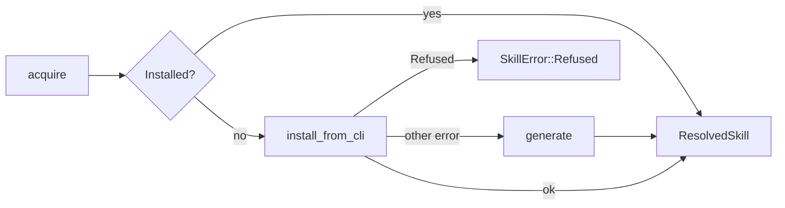

# Skills System

# Skills System (`loopsmith-skills`)

Sub-agent acquisition for a loop: how a node that needs a capability it does not have gets one, where that thing lands, and how the loop learns whether it was worth having.

The crate is deliberately small and dependency-free at the network boundary. Everything that touches the outside world (`curl`, `npx`, `git`) is shelled out rather than linked in, so a machine with no network or no Node degrades to "installed skills only" instead of failing to build.

## The shape of the problem

A loop cannot reason its way to knowing which sub-agents earn their keep. It has to try one, watch the gate, and keep what correlates with satisfied goals. That splits the crate into two halves that barely touch each other:

- **Acquisition** — get a skill onto disk (`acquire`, `install_default`, `generate`, `install_from_cli`, `clone_repo`), always into quarantine when it came from outside.
- **Evaluation** — rank skills by the gate verdicts that followed them (`recommend`, backed by `loopsmith_memory::score_skills`).

The rule joining them: acquisition is an action the loop may take on its own; **adoption is a proposal a human applies**. Nothing in this crate writes to the config.

## Acquisition order

`acquire(name, purpose, policy, project_root)` walks `policy.acquisition_order` (an `AcquisitionSource` list from `loopsmith-core`, defaulting to `installed → marketplace → generate`) and returns the first hit.



Two details in the fallthrough matter:

- A `SkillError::Refused` from the marketplace step **aborts the whole walk**. A name that failed the safety or blocklist check must not fall through to `generate`, which would happily write a skill under that same name.
- Any other marketplace error (`npx` missing, network down, package not found) is swallowed and the walk continues. Absence of a tool is not a policy decision.

`acquire` is called from `src/run/mod.rs::execute` and `src/run/dispatch.rs::ensure_skills` — the run plane resolves a node's declared skills before dispatching it.

## Where skills live

`skill_search_paths` defines the lookup order, nearest first:

1. `<project>/.claude/skills`
2. `<project>/generated-skills` — the quarantine directory
3. `<home>/.claude/skills`

Home comes from `loopsmith_util::platform::home_dir()`, not `$HOME` directly: Windows does not set `HOME` outside a POSIX emulation layer, and the user-level directory would silently vanish there.

A **skill is a directory containing `SKILL.md`** — that is the entire definition, enforced identically in `find_installed` and `list_installed`. A directory without the file is not a skill and is skipped, not reported as broken.

`find_installed` returns the first match; `list_installed` returns everything, deduplicated by name with the nearest directory winning. So a project-level `dup` shadows a quarantined `dup`, and only the project one is listed.

### Provenance versus location

`ResolvedSkill` carries both `source: Source` and `quarantined: bool`, and they answer different questions:

```rust
pub struct ResolvedSkill {
    pub name: String,
    pub source: Source,      // Installed | Marketplace | Generated
    pub path: PathBuf,
    pub quarantined: bool,
}
```

Anything found on disk reports `Source::Installed` — the filesystem records *where* a skill is, not where it came from. A skill sitting in `generated-skills/` is reported as `Installed` with `quarantined: true`; the flag carries the caveat. `Source::Marketplace` and `Source::Generated` are only set by the code paths that actually did the fetching or the writing, which is also what gets recorded on each `SkillTrial` so a track record carries its provenance.

## Quarantine

An acquired sub-agent runs with whatever the permission grant allowed. So everything fetched or generated lands in `policy.quarantine_dir` (default `generated-skills/`) with `quarantined: true`, and promotion to `~/.claude/skills/` stays a human act. `install_from_cli` passes `--dir .` with the quarantine directory as cwd precisely to keep the `skills` CLI out of the global path; `clone_repo` clones into the same place with `--depth 1` (a loop wants the skill, not its history).

## The two safety filters

Both run before anything is fetched, and both **refuse rather than sanitise** — a silently rewritten skill name installs something the caller did not ask for.

`is_safe_name` accepts ASCII alphanumerics plus `- _ / @ .`, up to 64 chars, and rejects empty strings, anything containing `..`, and anything starting with `/` or `-`. This covers both uses: a directory component and an argument passed to a package manager. `vercel-labs/agent-skills@react` passes; `../escape` and `-rf` do not.

`is_blocklisted` matches case-insensitively against `credential`, `secret`, `exfil`, `keylog`, `password`, `token-steal`. It is applied at three points: `install_from_cli`, `install_default`, and — importantly — inside marketplace ranking, so a 9,000-star `evil/credential-grabber` that matches the query perfectly is still never offered. **Popularity is not trust.**

`clone_repo` adds a third check, `loopsmith_core::is_safe_repo_url`: https git URLs only.

## Default skills (config section J)

`install_default(spec: &DefaultSkill, policy, root)` installs one of the loop's declared sub-agents. It is **idempotent** — a skill already on disk is returned untouched — so it is safe to call at the start of every run rather than once at setup. `src/run/mod.rs::install_default_skills` and `src/cmd/skills.rs::install` both rely on that.

Dispatch by `spec.source: SkillOrigin`:

| Origin | Behaviour |
|---|---|
| `Local` | Never fetched. Returns `SkillError::Missing` with instructions to place it under `.claude/skills/` or change its source. |
| `Marketplace` | `install_from_cli(spec.url.unwrap_or(&spec.name), quarantine)` |
| `Github` | `clone_repo` — requires `url`, https only |

After install, `spec.init_argv()` runs inside the installed directory **as argv, not through a shell**. See the note on `DefaultSkill::init_argv` in `src/config/default_skills.rs` for why.

## Generation — the last resort

`generate(name, purpose, quarantine)` writes a `SKILL.md` with frontmatter, an `## Approach` section, and an `## Output` section. The body is not filler; it encodes the loop's own contract back at the generated agent:

> A step whose result cannot be checked does not belong here.
> A claim without evidence cannot be acted on by the gate.

The description also states it was generated because nothing matched, and says *Review before promoting*. Generated skills are always `quarantined: true`.

## The marketplace module

`marketplace.rs` wraps the `claudemarketplaces.com` index (`DEFAULT_INDEX_URL`), a flat JSON array of plugin-marketplace repositories.

```
search_marketplace(terms, opts)
  ├── fetch_index   → curl -sS --fail --max-time N <url>
  └── rank_checked  → parse → rank_entries
```

`SearchOptions` defaults: `min_stars: 100`, `limit: 10`, `timeout_seconds: 20`.

`rank_entries` applies four filters in order, then sorts by relevance and breaks ties on stars:

1. `star_count() >= min_stars` — the trust floor
2. `!is_blocklisted(repo)` — the floor cannot be bought with stars
3. `relevance(terms) > 0` — a non-matching entry is dropped entirely, not ranked last
4. `take(limit)`

`MarketplaceEntry::relevance` is keyword overlap against a lowercased haystack of repo, description, categories and keywords. It is deliberately dumb: its job is to shortlist for a human or for the trust floor, not to be clever.

Everything the index returns is **untrusted data written by strangers**. Descriptions and keywords are text to rank, never instructions.

### Lenient deserialization, and why it exists

The `lenient` module supplies `deserialize_with` helpers for `stars`, `pluginCount`, `categories` and `pluginKeywords`, accepting a JSON number *or* a numeric string (comma-stripped), a list *or* a bare string, and treating a missing field as `0` / `[]`.

This is load-bearing. `stars` is absent on roughly a third of the live index, and third-party mirrors have been seen returning strings. Declaring these fields strictly made every parse fail — and because the failure was swallowed, the search silently returned nothing, which is indistinguishable from a working search with no hits.

That failure mode is why there are two ranking entry points:

- `rank_checked` returns `Result` and reports a parse failure as `SkillError::Refused("marketplace index did not parse: …")`.
- `rank` is the convenience wrapper that treats a parse failure as no results.

`search_marketplace` uses `rank_checked`. Prefer it in new code; reach for `rank` only where an empty list is genuinely the right answer.

### `search_skills_cli`

Separate from the index because the index lists plugin *bundles* while `npx skills find` lists individual skills. It returns raw stdout for the caller to present, and validates the query against `is_safe_name` with an escape hatch for spaces (a search term is allowed to be a phrase). Both `search_marketplace` and `search_skills_cli` back `loopsmith skills search`, via `src/cmd/skills.rs::search`.

## Outcome ranking

```rust
pub fn recommend(
    configured: &[String],
    trials: &[SkillTrial],
    min_trials: usize,
    adopt_above: f64,
    drop_below: f64,
) -> Recommendation  // { adopt: Vec<String>, drop: Vec<String> }
```

Each `SkillTrial` (from `loopsmith-memory`) pairs a skill used at a node with `satisfied` — the gate verdict that followed — plus `pass_rate`, `source`, and run/iteration identifiers. `score_skills` folds trials into `SkillScore`s; `recommend` reads `satisfaction_rate()` off each.

The logic is small and the three guards are the point:

- **`min_trials` gates everything.** A skill below the threshold is skipped in both directions. One lucky run is not evidence and must not drive a config change.
- **Adoption only suggests unconfigured skills.** A skill already in the config that scores well produces no output — there is nothing to propose.
- **Removal only suggests configured skills.** You cannot drop what was never adopted.

The rates are asymmetric on purpose: `>= adopt_above` and `<= drop_below`, with the band between them producing nothing. Ambivalent evidence is not a recommendation.

`recommend` returns a suggestion. `src/run/evolve.rs::skill_proposals` turns it into a file under `proposals/`, and applying it means a human editing `loop.yaml`.

## Errors

```rust
pub enum SkillError {
    Io(#[from] std::io::Error),
    Command { cmd: String, code: i32, stderr: String },
    Missing(String),   // binary not on PATH, or skill not resolvable
    Refused(String),   // policy said no
}
```

The distinction between `Missing` and `Refused` drives control flow, not just messaging — `acquire` continues past `Missing` and stops on `Refused`. `Command` keeps only the last line of stderr, which is where CLI tools put the actual failure.

## Shelling out

The private `run(cmd, args, cwd)` helper is the single subprocess path for the acquisition side (`marketplace.rs` builds its own `Command` for `curl` and `npx`, since those need different handling of failure and output). `run` checks `which(cmd)` first and returns `SkillError::Missing` rather than letting the OS produce a confusing spawn error.

`which` is re-exported from `loopsmith-util` and shared with the provider plane. It used to be a PATH-only copy here that accepted any file, so a non-executable `curl` on `PATH` read as "curl is available"; the shared version checks the executable bit. Do not reintroduce a local copy.

## Callers

| Caller | Uses |
|---|---|
| `src/run/mod.rs::execute` | `acquire` |
| `src/run/mod.rs::install_default_skills` | `install_default` |
| `src/run/dispatch.rs::ensure_skills` | `find_installed`, `acquire` |
| `src/run/evolve.rs::skill_proposals` | `recommend` |
| `src/cmd/skills.rs::list` | `list_installed` |
| `src/cmd/skills.rs::search` | `search_marketplace`, `search_skills_cli`, `SearchOptions` |
| `src/cmd/skills.rs::install` | `install_default` |

Downward: `loopsmith-core` for config types (`SkillPolicy`, `DefaultSkill`, `SkillOrigin`, `AcquisitionSource`, `is_safe_repo_url`), `loopsmith-memory` for `SkillTrial` / `SkillScore` / `score_skills`, `loopsmith-util` for `which` and `platform::home_dir`.

## Contributing notes

- **The crate tarball ships `src/` only.** `Cargo.toml` sets `include = ["/src/**/*", "/README.md"]` because the integration tests read `config/examples/` and `config/loop.schema.json` from the repo root, which no crate tarball can contain. Shipping them would hand a published crate tests that cannot pass. Keep repo-root fixtures out of unit tests in this crate.
- **Tests must not touch the network.** The existing fallthrough test constructs a `SkillPolicy` with `acquisition_order: [Installed, Generate]` specifically to skip the marketplace step. Follow that pattern.
- **Test names are assertions.** `a_high_star_credential_grabber_is_still_excluded`, `one_lucky_run_is_not_evidence`, `unsafe_names_are_refused_rather_than_sanitised` — each names an invariant rather than a function. New tests should read the same way.
- **The `SAMPLE` fixture in `marketplace.rs` mirrors the live payload**, including one entry with `stars` absent entirely. Do not "fix" that entry; it is the regression.
- Adding a new acquisition source means a new `AcquisitionSource` variant in `loopsmith-core` and a new arm in `acquire`. Anything that fetches must land in quarantine and must clear `is_safe_name` and `is_blocklisted` first.