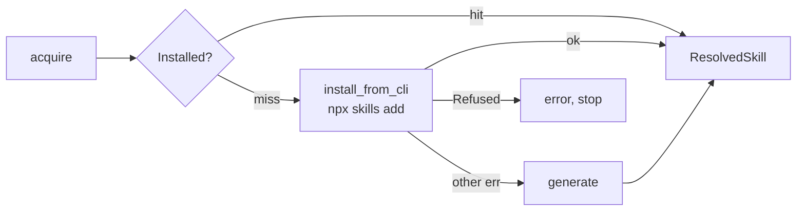

# Skills System

# Skills System (`loopsmith-skills`)

Sub-agent acquisition for a running loop: find the skill a node needs, install it somewhere inert if it is not already on disk, record what happened when the gate ruled, and rank skills by that record.

The crate is deliberately small and dependency-light. Its two files — `src/lib.rs` (acquisition, safety, ranking) and `src/marketplace.rs` (the `claudemarketplaces.com` index) — hold everything, and all network work is shelled out to `curl`, `npx`, and `git` rather than linked in. A machine with none of those degrades to "installed only" instead of failing to build.

## The two ideas this module rests on

**Quarantine is the default, not the exception.** Anything the loop acquires lands in a quarantine directory (`generated-skills/` by default) and stays there until a human moves it. An acquired sub-agent runs with whatever your permission grant allowed, so acquisition is a *proposal*, not a decision. Every `ResolvedSkill` carries a `quarantined: bool` so callers can never lose track of that distinction.

**Selection is ranked by outcome, not by the model's opinion.** A loop cannot reason its way to knowing which sub-agents earn their keep. `recommend` looks only at `SkillTrial` records — each pairing a skill with the gate verdict that followed it — and proposes adoptions and drops from that. It still cannot apply them; a proposal is written and a human edits the config.

## Acquisition: three sources, in configured order

`acquire(name, purpose, policy, project_root)` walks `policy.acquisition_order`, a `Vec<AcquisitionSource>` from `loopsmith-core`, and returns the first hit.


```mermaid
flowchart LR
    A[acquire] --> I{Installed?}
    I -->|hit| R[ResolvedSkill]
    I -->|miss| M[install_from_cli<br/>npx skills add]
    M -->|ok| R
    M -->|Refused| X[error, stop]
    M -->|other err| G[generate]
    G --> R
```

The order matters in one non-obvious way: a `SkillError::Refused` from the marketplace step **aborts the whole walk** rather than falling through to generation. A refusal means a safety floor said no — an unsafe name, a blocklisted name — and quietly generating a skill under that same name would route around the refusal. Any other error (no `npx`, network down, package not found) continues to the next source.

### 1. Installed — `find_installed`, `list_installed`

A skill is a *directory containing `SKILL.md`*. `skill_search_paths` defines where to look, nearest first:

| Order | Directory | Quarantined |
|---|---|---|
| 1 | `<root>/.claude/skills/` | no |
| 2 | `<root>/generated-skills/` | yes |
| 3 | `<home>/.claude/skills/` | no |

Home comes from `loopsmith_util::platform::home_dir()`, not `$HOME` — Windows does not set `HOME` outside a POSIX emulation layer, and reading it directly makes the user-level skills directory silently vanish there.

`find_installed` always reports `Source::Installed`, even for a skill that originally came from the marketplace. The filesystem tells you *where* something is, not where it came from; the `quarantined` flag carries the only provenance fact that is actually knowable at that point. `list_installed` deduplicates by name with the nearest directory winning, so a project skill shadows a quarantined one of the same name.

### 2. Marketplace — `install_from_cli`, `clone_repo`

`install_from_cli(spec, quarantine)` runs `npx --yes skills add <spec> --dir . -y` with the working directory set to the quarantine path. The `--dir .` is the load-bearing part: it keeps the install out of the global skills path. The resulting name is the spec's last segment after `@` and `/`, so `vercel-labs/agent-skills@react` installs as `react`.

`clone_repo` handles `SkillOrigin::Github`: `git clone --depth 1` (the loop wants the skill, not its history) after `loopsmith_core::is_safe_repo_url` confirms an https URL. Anything else is refused.

### 3. Generate — `generate`

The last resort. Writes a single `SKILL.md` with YAML frontmatter, the stated purpose, an Approach section and an Output section — both phrased around producing evidence the gate can act on — and a `Review before promoting` note in the description. Returns `Source::Generated`, always quarantined.

### Declared defaults — `install_default`

Separate from `acquire`, and used at plan time rather than dispatch time. `install_default(spec: &DefaultSkill, policy, root)` installs one of the loop's section-J declared sub-agents. It is **idempotent**: a skill already found on disk is returned untouched, which is what makes it safe to run at the start of every run rather than once at scaffold time.

Three origins, from `DefaultSkill::source`:

- `SkillOrigin::Local` — never fetched. Returns `SkillError::Missing` with an error message that names the fix (put it under `.claude/skills/` or change its source).
- `SkillOrigin::Marketplace` — `install_from_cli` on `spec.url` if present, otherwise `spec.name`.
- `SkillOrigin::Github` — `clone_repo`.

After install, `spec.init_argv()` runs inside the installed directory if it is non-empty. That is **argv, not a shell** — the setup step for a skill declared in a config file is not an eval hatch.

## The safety floors

Three functions guard every install path. All of them refuse rather than repair.

```rust
pub fn is_safe_name(name: &str) -> bool
pub fn is_blocklisted(name: &str) -> bool
pub use loopsmith_util::which;   // shared with the provider plane
```

**`is_safe_name`** accepts ASCII alphanumerics plus `- _ / @ .`, length 1–64, and rejects anything containing `..` or starting with `/` or `-`. It is not a sanitiser by design: a silently rewritten skill name installs something the caller did not ask for. `vercel-labs/agent-skills@react` and `my_skill.v2` pass; `../escape`, `-rf`, and `a/../../b` do not.

**`is_blocklisted`** does a case-insensitive substring match against `credential`, `secret`, `exfil`, `keylog`, `password`, `token-steal`. This runs *after* the star floor and independently of it — the test `a_high_star_credential_grabber_is_still_excluded` pins a 9000-star, perfectly-matching entry that must never be offered. Popularity is not trust.

**`which`** is re-exported from `loopsmith-util` rather than reimplemented. The local copy it replaced was PATH-only and accepted any file, so a non-executable `curl` on PATH read as "curl is available". The shared version checks the executable bit.

The internal `run(cmd, args, cwd)` helper funnels every subprocess through `which` first, returning `SkillError::Missing` before attempting a spawn, and on failure captures only the *last* line of stderr into `SkillError::Command`.

## The marketplace index

`marketplace.rs` fetches `https://claudemarketplaces.com/api/marketplaces` — a flat JSON array of roughly 2,600 plugin-marketplace repositories — via `curl -sS --fail --max-time <n>`.

Everything the index returns is **untrusted data written by strangers**. Descriptions and keywords are text to rank, never instructions, and nothing installs without clearing the trust floors.

### Parsing: lenient by necessity

The `lenient` module supplies two `deserialize_with` helpers, `number` and `string_list`, both accepting an absent field, a scalar, or the "wrong" shape:

- `stars` and `pluginCount` are numbers in the live index but **absent on roughly a third of entries**, and third-party mirrors return strings. `lenient::number` handles `4200`, `"1,200"` (commas stripped), and missing (→ `0`).
- `categories` and `pluginKeywords` are arrays, but a bare string appears in the wild. `lenient::string_list` wraps it.

This is not defensive paranoia; it is a recorded bug. Declaring `stars: String` made every parse fail, the failure was swallowed, and the search "worked" while returning nothing. Both the crate tests and `templates/marketplaces.json` document the verified live shapes so the mistake is not repeatable.

### Ranking and the two entry points

`MarketplaceEntry::relevance` counts how many search terms appear in a lowercased haystack of `repo + description + categories + pluginKeywords`. It is deliberately dumb — its job is to shortlist for a human or for the trust floor, not to be clever.

`rank_entries` then applies, in order: the star floor (`min_stars`, default 100) → the blocklist on `repo` → drop anything with zero relevance → sort by relevance descending, tie-broken by stars → truncate to `limit`.

Two public forms, and the difference is the point:

- **`rank_checked`** returns `Err(SkillError::Refused)` on a parse failure. A broken index must not look like a working search that found nothing.
- **`rank`** is the convenience wrapper that treats a parse failure as an empty list. Use it only where an empty result is genuinely acceptable.

`search_marketplace` = `fetch_index` + `rank_checked`, and is what the CLI calls.

`search_skills_cli(query, cwd)` is separate because the two sources list different things: the index lists plugin *bundles*, the `skills` CLI lists *individual* skills. It shells `npx --yes skills find <query>` and returns raw stdout, after a looser validation pass that permits spaces in a search term.

`SearchOptions` defaults: `min_stars: 100`, `limit: 10`, `timeout_seconds: 20`.

## Outcome ranking

```rust
pub fn recommend(
    configured: &[String],
    trials: &[SkillTrial],
    min_trials: usize,
    adopt_above: f64,
    drop_below: f64,
) -> Recommendation           // { adopt: Vec<String>, drop: Vec<String> }
```

`recommend` delegates the arithmetic to `loopsmith_memory::score_skills`, which folds `SkillTrial` records into `SkillScore`s carrying a `trials` count and a `satisfaction_rate()`. The policy on top is three rules:

1. **`trials < min_trials` → skip entirely.** One lucky run is not evidence, and the test `one_lucky_run_is_not_evidence` pins that a single satisfied trial drives no config change.
2. **`rate >= adopt_above` and not already configured → adopt.** An already-configured skill is never re-adopted.
3. **`rate <= drop_below` and currently configured → drop.** A skill that is not configured cannot be dropped.

A `SkillTrial` records `run_id`, `iteration`, `node_id`, `skill`, `source` (the `Source` string, so a track record carries its provenance), `pass_rate`, `satisfied`, and optional `tokens`. `Source::as_str` gives the stable wire form: `installed`, `marketplace`, `generated`.

The output is a `Recommendation`, not a config mutation. The crate has no path that writes a skill into a loop config — `loopsmith-run` turns the recommendation into a proposal on disk and a human applies it.

## Where it plugs in

| Caller | Function | When |
|---|---|---|
| `loopsmith-run/src/planning.rs` → `install_default_skills` | `install_default` | plan time, per declared default skill |
| `loopsmith-run/src/waves.rs` → `resolve_skills` | `acquire` | building a wave |
| `loopsmith-run/src/dispatch.rs` → `ensure_skills` | `find_installed`, `acquire` | just before a node runs |
| `loopsmith-run/src/evolve.rs` → `skill_proposals` | `recommend` | after a run, writing `proposals/` |
| `src/cmd/skills.rs` → `list` / `search` / `install` | `list_installed`, `search_marketplace`, `search_skills_cli`, `install_default` | the `loopsmith skills` subcommands |

Downward, the crate depends on `loopsmith-core` for the config types (`SkillPolicy`, `DefaultSkill`, `SkillOrigin`, `AcquisitionSource`, `is_safe_repo_url`), `loopsmith-memory` for `SkillTrial` / `SkillScore` / `score_skills`, and `loopsmith-util` for `which` and `platform::home_dir`. It depends on no HTTP client, no async runtime, and nothing else.

The user-facing surface is the `loopsmith skills` command group:

```bash
loopsmith skills search <terms...>       # search_marketplace + search_skills_cli
loopsmith skills acquire <config> <name> # acquire, into quarantine
loopsmith skills install <config>        # install_default for every section-J default
loopsmith skills list <config>           # list_installed
loopsmith skills scores <config>         # the trial record behind recommend
```

## Contributing notes

- **Add a safety floor, do not weaken one.** `is_safe_name` and `is_blocklisted` are checked at the top of `install_from_cli`, `install_default`, and `generate`, and again on `repo` inside `rank_entries`. New install paths must re-check; the floors are not enforced by a type.
- **Refusal must not fall through.** If you add an `AcquisitionSource`, preserve `acquire`'s handling: `Err(SkillError::Refused(_))` propagates immediately, every other error continues the walk.
- **A parse failure is not an empty result.** Prefer `rank_checked` in new code. This crate has already shipped that bug once.
- **Do not link an HTTP client.** The shell-out to `curl`/`npx`/`git` is what keeps this crate dependency-free and lets a network-less machine degrade gracefully. `SkillError::Missing` is the designed outcome, not a failure to handle.
- **Tests must not touch the network.** `acquire_falls_through_to_generation_when_nothing_is_found` sets an explicit `acquisition_order` of `[Installed, Generate]` for exactly this reason. Marketplace tests run against the `SAMPLE` constant in `marketplace.rs`, which mirrors the live payload including an entry with `stars` absent.
- **Crate packaging is narrow on purpose.** `include = ["/src/**/*", "/README.md"]`. Integration tests read `config/examples/` and `config/loop.schema.json` from the repository root, which no crate tarball can contain; shipping them would hand a published crate tests that cannot pass.